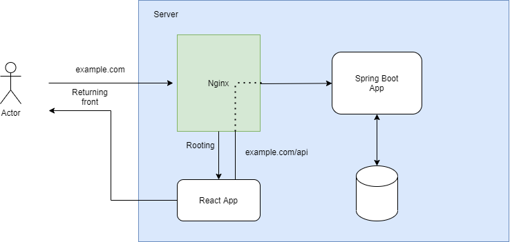

# react_nginx_tomcat

誰かのやりたいことを検証するためだけのリポジトリ。
構成としては以下の通り。
- nginx: listen 80 -> ./frontend 配下の react app
- react app -> sprint_boot_app:8080 でapiをコールする



## 何検証してんの？
フロントからサーバサイドのAPIをコールしたときにCORSで403になるらしい。多分なるやろな。
ということで以下を確認することが目的。
- [x] 問題が再現できるか
- [x] 問題を解決できるか
  - 原因は以下の通り。
    - serversideが動いていない: `gradlew bootRun` でローカルでは起動できていたが、docker container上ではこれだとだめだった。`gradlew build` したのち、生成される `build/libs/hogehoge.jar` を `java -jar` で実行させるのが良い。
    - preflight requestが飛んでいた: 変にヘッダを設定したget/postなリクエストはsimple requestではなくなるため、 option methodでコールする preflight requestが送信される。このoption methodでコケると本リクエストが送信されることなく止まる。ので、余計なヘッダは消そう
      - ちなみに `Content-Type` に `application-json` を指定することでpreflight requestが送信される。
        - ので、この場合はoptionのリクエストを許容する必要があり、サーバサイド側で以下の内容を含めたresponseを返す実装が必要になる。多分SpringBoot側としてはそれは `＠CrossOrigin` アノテーションを付与するだけで良いのかも。
        ```
        HTTP/1.1 200 OK
        Access-Control-Allow-Origin: http://localhost
        Access-Control-Allow-Credentials: true
        Access-Control-Allow-Methods: GET,POST,HEAD,OPTIONS
        Access-Control-Allow-Headers: X-MyRequest,X-MyOption
        ```

- [ ] JSONでPOSTしたときの処理を実装して、CORSの403がでないか確認する。

## 検証状況
- `http://localhost:8080` でレスポンスが取れるのを確認
- `http://localhost` で画面の表示を確認。
  - 一方でAPIの呼び出しには CORS で403が返ってくる。ので、なんか対策してみる
    - header に全てのサイトへの許可するようにパラメータを設定した => だめだった
    - Controller側に `@CrossOrigin` アノテーションを付与してみた => だめだった
    - これを削除した　=>　いけた。
    >header に全てのサイトへの許可するようにパラメータを設定した => だめだった

## How to run this ?
1. Install dependency for frontend and build front-codes.
  ```
  $ npm install --prefix ./frontend
  $ npm run build --prefix ./frontend
  ```
2. Build serverside code
  ```
  $ cd serverside
  $ ./gradlew build
  ```
3. Run below command
  ```
  $ docker-compose build
  $ docker-compose up -d
  ```
